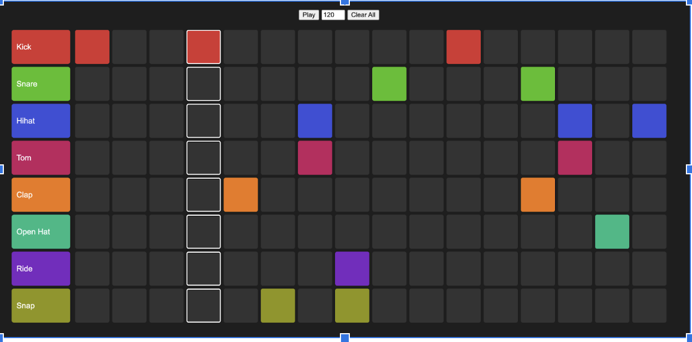
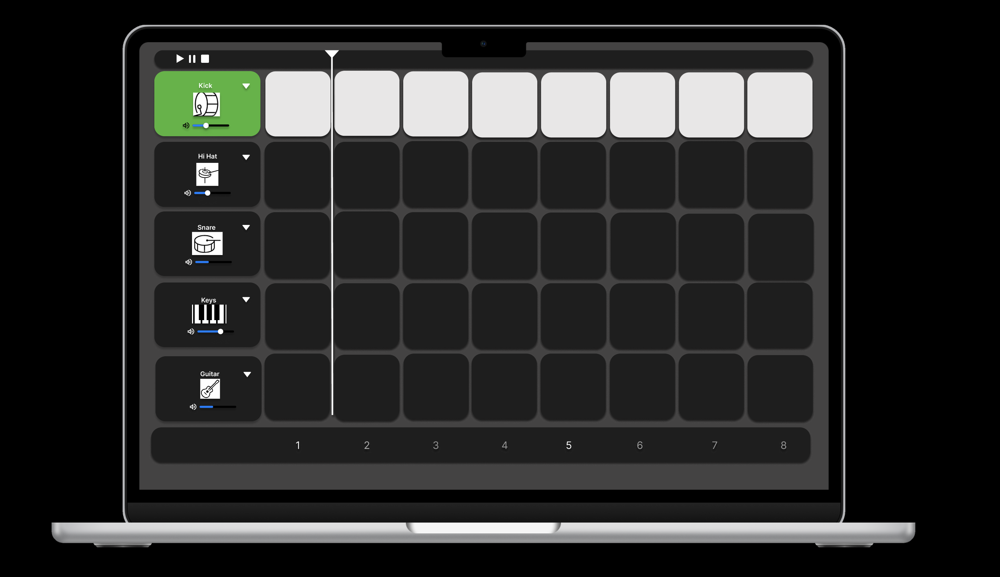
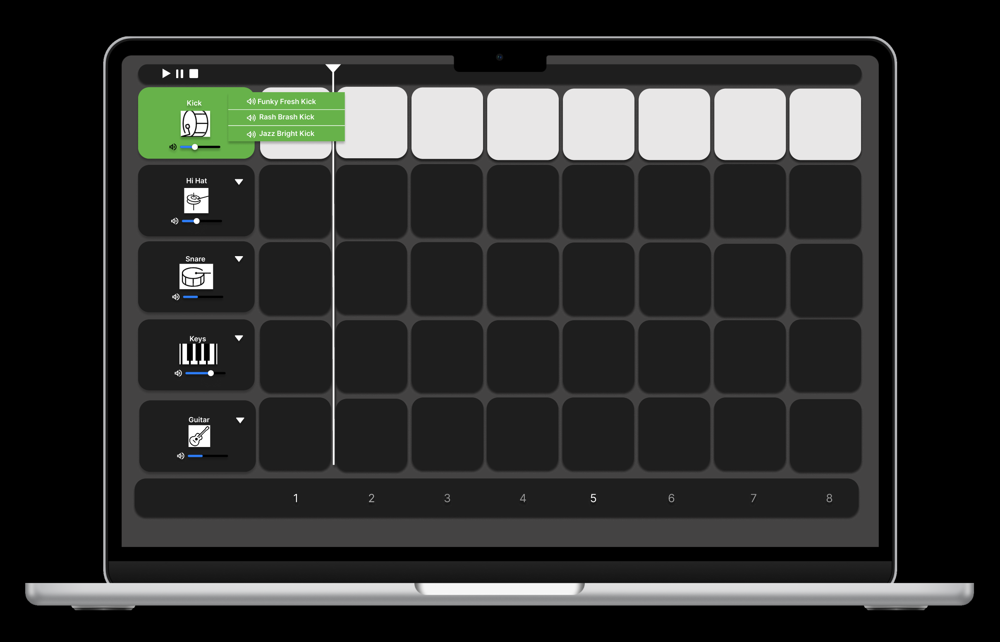
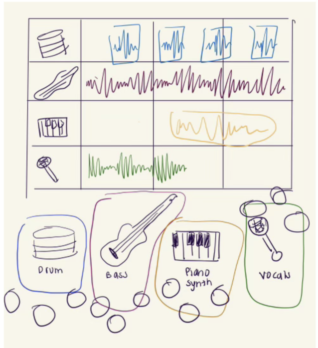
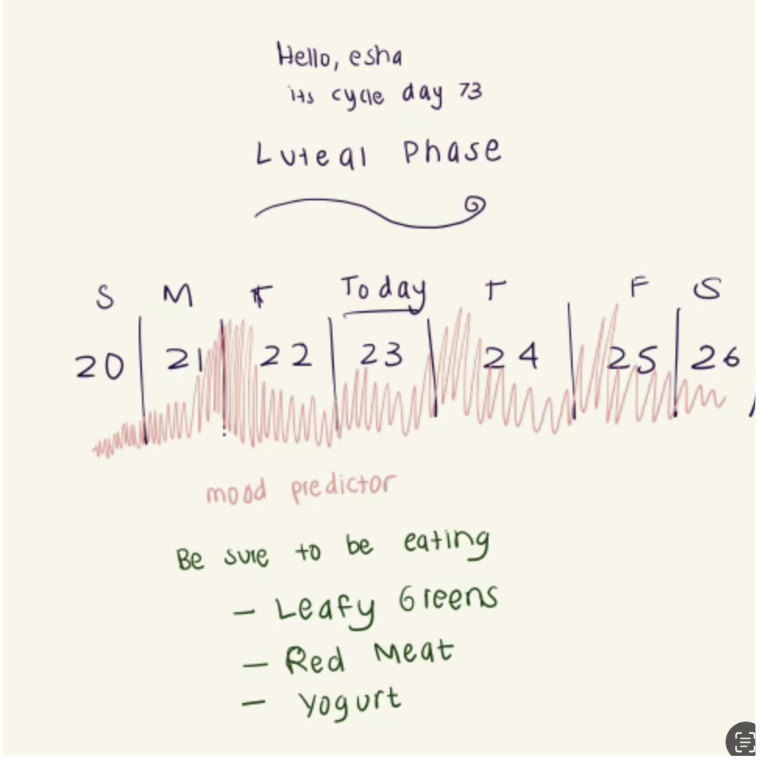
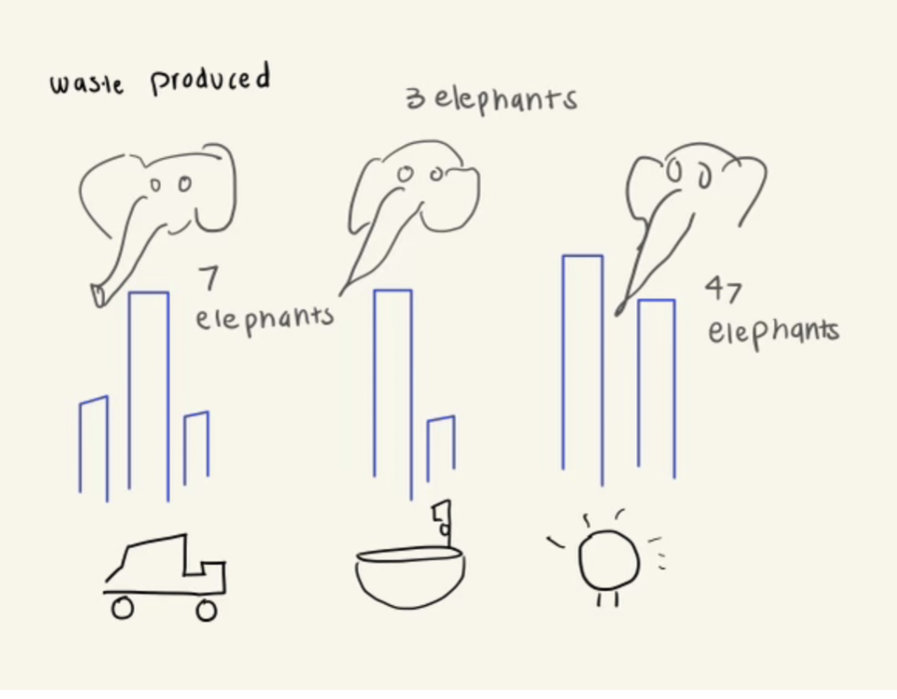

<mark>**Note that this document order from FP4 -> FP1**</mark>

<mark>Please sign up for the study</mark> at [https://tinyurl.com/pui-study](https://tinyurl.com/pui-study) to allow us to use your submission to create a better GenAI assistant for designers!

---

# **FP4 \- Final Project Writeup**

I tested the website on WAVE to iterate on accessibility. This site should be tested on laptop screens as well as tablet screens.

## Part 1: Website Description

  The purpose of my website is a  music beat maker tool designed to help users easily dive into beat-making with minimal friction. Users tap on grid pads to experiment with rhythm, creating their own unique beats. This tool is intended as an informative, intuitive, and accessible entry point for anyone interested in making music, regardless of their experience level. It keeps users engaged as they get to explore creatively and maybe try a new way of expressing themselves. The target audience intended to be hiring managers and recruiters, or anyone who wants to get to know me more on my portfolio site. I have incorporated sounds from my own library, allowing users to experience a part of my creative world/hobby.  By integrating this in my portfolio, I hope users get to know me more intimately through this auditory experience, as well as get to experience the process of making music to further understand what I experience on a macrocosmic level. 

## Part 2: User Interaction 

This is an example of what the site would look like upon load, for the user to see an example of an existing beat before playing around with it. I did not have the time to input this change, and struggled with creating it, but wanted to indicate what I would accomplish with more time.

How a user would interact with your website? For each step, briefly but clearly state the interaction type & how we should reproduce it.

- The user clicks on a cell, which results in it lighting up. The interaction type is a click, and is reproduced by clicking on any cell within the grid on the drum machine page. The cell will light up to indicate it is active.

- The user presses play and listens to the sound of the instrument associated with that cell. The interaction type is a button press, and is reproduced by clicking  the "Play" button located above the grid. The beatmaker will play the pattern, and the active cells will play the corresponding instrument sounds.

- The user creates patterns on the drum machine and adjusts until satisfied. The interaction type is clicking on grid cells, and it can be reproduced through clicking on multiple cells within the grid to activate or deactivate them. The changes will be reflected visually on the grid, and audibly during playback, providing feedback to the user of their changes.

- The user can clear the grid if needed. This interaction is a button press, which is reproduced through clicking the  "Clear" button above the grid. All cells in the grid will deactivate, and the grid will reset to a blank state.

- The user adjusts the tempo by typing in the tempo blank bar. The bar is originally stored with the default BPM of 120. The interaction type is inputting text or using the arrows to increase/decrease tempo. The user can reproduce by typing a number into the tempo bar located above the grid, and clicking Enter or outside of the input box. The tempo of the playback will adjust accordingly. 

## Part 3: External Tool

Describe what important external tool you used (JavaScript library, Web API, animations, or other). Following the bulleted list format below, reply to each of the prompts.

1. Howler.js 
   * Why did you choose to use it over other alternatives? (2 sentences max)  
   I chose to use Howler. Js, a javascript audio library, as it is simple to use and works very well for playing and managing audio. It also supports multiple sound formats, which ensures compatibility across all browsers, and is great for real-time audio playback. 
   * How you used it? (2 sentences max)  
   I used Howler.js to load individual instrument sounds dynamically and play them either when a user clicks on a cell or during the timed beat playback.  It handles the audio for each instrument in the drum machine. Each sound is tied to a specific instrument and triggered in sync with the beat pattern.
   * What does it add to your website? (2 sentences max)  
    Howler.js makes it easy to play sounds on time and ensures smooth audio playback. It helps create a better experience for users by managing sounds reliably and efficiently.

## Part 4: Design Iteration

Describe how you iterated on your prototypes, if at all, including any changes you made to your original design while you were implementing your website and the rationale for the changes. (4-8 sentences max)

I made a few changes to the original design as I worked on coding this website. At first, I wanted to let users load their own sounds into the beat player, but I realized this would be too complicated to implement and use. Instead, I decided to use a set of preloaded sounds to keep things simple and reliable. This also allowed me to source sounds from my personal library for a personal touch. I also adjusted the grid layout to make it easier to use, aligning the instrument labels more clearly with the rows  and making the beat player more straightforward and user-friendly.

## Part 5: Implementation Challenge

What challenges did you experience in implementing your website? (2-4 sentences max)

I encountered challenges using only HTML for styling and managing colors in the grid and rows, which prompted me to incorporate JavaScript for dynamically updating colors and maintaining consistency. Ensuring that individual cells lit up while the row also highlighted simultaneously required careful coding to balance these overlapping effects. Additionally, sourcing and integrating a JavaScript library for sound management was new to me, which made the process initially challenging. After researching options and consulting resources like Stack Overflow, Google, and GPT, I decided that Howler.js was the most suitable library for the project, despite my lack of experiences with libraries. 

## Part 6: Generative AI Use and Reflection

Describe how you used Generative AI tools to create this final project (fill in the following information, write \~500 words in total).

I used ChatGPT for debugging and generating ideas. For instance, I asked for help with specifcially implementing row and grid layouts in order to keep color consistent, and asked about rules for integrating a JavaScript library. These tools provided useful initial insights, although some suggestions needed refinememnt.

When I asked Chat GPT for assistance with iterating through a grid to adjust the playhead, the suggestions provided  were not helpful. Instead, I consulted my TA, who recommended using a for loop, which I successfully implemented. While I primarily wrote the project’s code, I relied on AI-generated suggestions for debugging and solving specific challenges. I critiqued these suggestions based on my prior knowledge and ensured their validity before incorporating them. I did not build upon some of AI’s suggestions for toggling the grid to align better with project requirements.

### Usage Experiences by Project Aspects

Feel free to edit the column \_ (other?) or add more columns if there's any other aspect in your project you've used the GenAI tools for.

For the following aspects of your project, edit the corresponding table cell to answer:
- *Usage*: Whether you used / did not use this tool for the aspect. Enter [Yes/No]
- *Productivity*: Give a rating on whether this tool makes your productivity for X aspect [1-Much Reduced, 2-Reduced, 3-Slightly Reduced, 4-Not Reduced nor Improved, 5-Slightly Improved, 6-Improved, 7-Much Improved].

| Tool Name | Ratings | design | plan | write code | debug | \_ (other?) |
| :---- | :---- | :---- | :---- | :---- | :---- | :---- |
| Chat GPT | Usage | No| Yes | Yes | Yes| No |
| Tool1 | Productivity | 1 | 4 | 3| 5| 1|

### Usage Reflection

> Impact on your design and plan 
* It matched my expectations and plan in [FP2](#generative-ai-use-plan) in that … For example, 
  1. ChatGPT: It helped clarify library functions and identify the most suitable audio librar for my project. It supported my Fp2 plan by aiding in debugging and refining details in implementation. 
* It did not match my expectations and plan in [FP2](#generative-ai-use-plan) in that … For example, 
  1. ChatGPT: I did not explore generative AI for user customization of sound choices specifically as initially planned. Instead, I ended up using it more extensively for debugging.
* GenAI tool did/did not influence my final design and implementation plan because … For example, 
  1. ChatGPT: Did not influence my final design and implementation plan because I was using it to mostly confirm ideas I already had. I used it for for clarifying JavaScript concepts and troubleshooting, but the design and functionality were developed independently through my own knowledge and testing

> Use patterns
* I accepted the generations when …  For example, 
  1. ChatGPT: When ChatGPT suggested using a specific library for handling audio, I followed the recommendation because it aligned with my project’s requirements and worked well. I also took suggestions on how to incorporate the js Library into my existing code. I also took suggestions for requestAnimationframe, to help call a function repeatedly and keep the playhead motion consistent, which assisted greatly in my project. 
* I critiqued/evaluated the generated suggestions by … For example, 
  1. ChatGPT: GPT suggested an approach for grid iteration for the playhead, but I rejected it because it didn't make sense and sought an alternative solution through manual debugging and TA consultation.

> Pros and cons of using GenAI tools
* Pros
  1. ChatGPT: ChatGPT accelerated problem-solving for debugging challenges, and offered strong suggestions for code ideas after I gave it a general plan. It also offered multiple approaches to issues, which helped refine my understanding of the task.
* Cons
  1. ChatGPT: Some suggestions are overly generic or inaccurate, or complicate simple ideas too much. I would use Google or draw things out instead, if that would happen. 

### Usage Log

Document the usage logs (prompts and chat history links) for the GenAI tools you used. Some tools may not have an easy way to share usage logs, just try your best! Some instructions for different tools:

1. [ChatGPT](https://chatgpt.com/share/67577b4c-feec-8001-96bc-eac013065485) [ChatGPT2](https://chatgpt.com/share/67578bb6-2498-8001-83ae-89ac25867f4f)

---

# **FP3 \- Final Project Check-in**

Document the changes and progress of your project. How have you followed or changed your implementation & GenAI use plan and why? Remember to commit your code to save your progress.

## Implementation Plan Updates

- [ ] Week 9 Oct 28 \- Nov 1:
  - [X] FP1 due
  
- [X] Week 10 Nov 4 \- Nov 8:   
  - [X] FP2 due

- [X] Week 11 Nov 11 \- Nov 15:  FP 3
- [X] Week 12 Nov 18 \- Nov 22:  Iterations
- [X] Week 13 Nov 25 \- Nov 29:  Final Touches

  - [X] Thanksgiving  
- [X] Week 14 Dec 2 \- Dec 6
  - [X] FP4 due 

## Generative AI Use Plan Updates

- I plan to use Gen AI to debug and work on complex issues.

Remember to keep track of your prompts and usage for [FP4 writeup](#part-6-generative-ai-use-and-reflection).

---

# **FP2 \- Evaluation of the Final project**

## Project Description

My project is a music beat maker tool designed to help users easily dive into beat-making with minimal friction. Users can pick sounds for each instrument, load them onto a beatmaker grid, and tap on grid pads to experiment with rhythm and sound, creating their own unique beats. This tool is intended as an informative, intuitive, and accessible entry point for anyone interested in making music, regardless of their experience level. I also want to make it personal by incorporating sounds from my own library, allowing users to experience a part of my creative world. By integrating this in my portfolio, I hope users get to know me more intimately through this auditory experience, as well as get to experience the process of making music to further understand what I do on a macrocosmic level.

## High-Fi Prototypes

### *Prototype 1*

[Music Beatmaker Prototype One](https://www.figma.com/proto/38RhWBfReSF4KtNIf8MIg5/Music-Beatmaker?node-id=15-70&node-type=frame&t=3VUYePJEOFpRnw5X-0&scaling=scale-down&content-scaling=fixed&page-id=0%3A1&starting-point-node-id=15%3A70)

The feedback I received here included that it was clear that the grid could be clicked on, and that the instruments indicated some sort of music making aspect. The drop down led to sound selection, which users found to be accessible. The labeling of the beat numbers was confusing for users regarding the visibility of a system status.

### *Prototype 2*

[Music Beatmaker Prototype Two](https://www.figma.com/proto/38RhWBfReSF4KtNIf8MIg5/Music-Beatmaker?node-id=15-70&node-type=frame&t=3VUYePJEOFpRnw5X-0&scaling=scale-down&content-scaling=fixed&page-id=0%3A1&starting-point-node-id=15%3A70)

The feedback received in this version was similar, but users preferred to have a dropdown over the buttons that were displayed below the beat maker for sound selection. 

## Usability Test

During my evaluation, I received helpful user feedback regarding when learning about the way they perceived my tool at a first glance. The users I interviewed understood the tool was integrating the sounds of multiple instruments in some way, and that the pads on the grid were clickable and would respond with visual feedback. They discovered the dropdown which led to a selection of different sounds. There was confusion regarding the numbers on the bottom and why they were highlighted a specific way, which suggested the use of more clarifying highlighting or a grid pattern where the numbers were to indicate that the numbers referred to the beat count. Upon further consideration, it was made clear that having a playhead to indicate a position in the beat would be most helpful in conveying the concept of the beat count, which I decided to implement in my later iteration. One user also suggested having a preview of the sound in the dropdown before the user decided to select it, which I decided to incorporate in my updated hi fi prototype. We also clarified that it would be helpful to highlight the entire row that an instrument was activated on to indicate the system’s status, which I also incorporated in further iteration.

## Updated Designs

In the updated design, I included a playhead to give more meaning to the beat count at the bottom and indicate the position in the beat. I also included highlighted squares to indicate which instrument and which row is selected. I also included a sound preview where users can hover over each sound in the dropdown to hear it out loud before loading it into the beat maker.

## Feedback Summary

In the lab session, I presented two versions of the high-fidelity prototypes, each with a different approach for sound selection. In the first version, users selected sounds by clicking a dropdown menu beside each instrument, allowing them to choose one of three available sounds to load into the grid. In the second version, users could activate an instrument or its row to reveal three sound options below the beat maker. Here, they could preview each sound by pressing a play button before selecting their choice. During lab and post lab discussion, I found that having a dropdown was a preferred approach because users felt that it was less tasks and less time consuming, and appreciated the concise and accessible layout it provided for sound selection.

## Milestones

By next wednesday Nov 13 Week 11, I plan to have begun implementing the core structure using HTML, CSS, and JavaScript. I hope to integrate Tone.js or Howler.js libraries to allow users to play and control audio samples. I plan to have set up a basic beat grid or sequencer where users can select beats or samples on a timeline. I will also test basic playback functionalities and verify audio syncing.

By Week 12 Nov 20, I will have built out UI components (e.g., play/pause button, tempo slider, volume control).  I will add interactivity, allowing users to adjust tempo and volume dynamically. I would begin implementing a save/load functionality for beat patterns if possible.

By Week 13  Nov 27, I would like to polish the UI for usability and aesthetics, and fix any remaining bugs or audio syncing issues. I would also implement any additional features (e.g., export beat as audio file, additional sound effects).

### *Implementation Plan*

- [ ] Week 9 Oct 28 \- Nov 1:
  - [X] FP1 due
  
- [X] Week 10 Nov 4 \- Nov 8:   
  - [X] FP2 due

- [X] Week 11 Nov 11 \- Nov 15:  FP 3
- [X] Week 12 Nov 18 \- Nov 22:  Iterations
- [X] Week 13 Nov 25 \- Nov 29:  Final Touches

  - [X] Thanksgiving  
- [X] Week 14 Dec 2 \- Dec 6
  - [X] FP4 due 

### *Libraries and Other Components*

Howler.js
Tone.js

## Generative AI Use Plan

For FP3, which involves building foundational features, I plan to use ChatGPT  to assist in structuring complex JavaScript functions and to help debug issues that may arise in early stages. Since I am working with audio libraries (such as Tone.js for sound synthesis), I’ll use ChatGPT to clarify library functions or explore customization ideas. Generative AI might not be as helpful with nuanced UI/UX design decisions that require deep contextual awareness of my target users. Also, AI may have limitations in complex, real-time audio processing requirements that need advanced and precise fine-tuning. I plan to use it responsibly by using it to support my coding and not or over rely on it. I will treat AI suggestions as learning opportunities by analyzing and understanding why certain solutions are recommended, not just copy and paste. 

# **FP1 \- Proposal for Critique**

## Idea Sketches.

### *Music Beatmaker*

Add a few sentences about your design. Briefly state the motivation of each project idea. Example questions to answer:

* What is the basic idea of your final project? (1-2 sentences)  

  The main purpose of this idea is engage users through an interactive interface that allows for real-time music manipulation, making music creation accessible. It would serve as a learning tool for users interested in understanding music composition and arrangement without needed experience.

* How do you plan to make your design interactive and engaging?  

Within this design, I hope to show users how creativity and personal expression can be channeled through direct manipulation of audio. Users get to interact with this design by arranging loops of audio tracks and listen to them in isolation as well. 

* How do you plan to make your design accessible? 

I plan to use audio cues to help users understand changes they’re making in real-time, as well as label items clearly as to not require sight. I also plan to include tooltips and short text explanations or tutorials that guide users through composition concepts in simple terms. I also plan to include high-contrast themes for better readability.

* What information do you specifically want to convey and include on your website?

I hope to include an overview of the tool and its purpose, as well as the interactive elements themselves, and options to share and export their audio tool. 

### *Women's Cycle HeatMap*

Add a few sentences about your design. Briefly state the motivation of each project idea. Example questions to answer:

* What is the basic idea of your final project? (1-2 sentences) 

For this project, I would create a clear and intuitive visual representation of the different phases of the menstrual cycle (e.g., menstrual, follicular, ovulatory, luteal), and help users track changes in bodies and moods. I hope to take personalized data and provide personalized insights based on the user's data, such as predicting when certain symptoms may occur or suggesting lifestyle adjustments. 

* How do you plan to make your design interactive and engaging?  

Within this design, I plan to make it engaging by having user's input their own data and interact with a visual that includes a heatmap which indicates the fluctuations of moods in accordance to their cycle. 

* How do you plan to make your design accessible? 

I plan to represent each phase of the cycle (menstrual, follicular, ovulatory, luteal) with distinct colors, ensuring each meets color contrast standards. I want to include clear text labels for each phase, along with descriptions of what each phase means and its typical symptoms.

* What information do you specifically want to convey and include on your website?

I hope to include information regarding the menstrual phases in general, as well as a calendar, a heatmap for mood, and reccomendations for food/exercise. I wish to convey that information such as this should be accessible without a paywall.

…

### *Data Visualizations with Tangible Comparisons*

Add a few sentences about your design. Briefly state the motivation of each project idea. Example questions to answer:

* What is the basic idea of your final project? (1-2 sentences) 

For this idea, I hope to transform abstract or hard-to-understand data into relatable, easy-to-digest information through visual and tangible comparisons. I believe that when users can visualize data in a tangible way, they are better equipped to make decisions, whether related to personal choices (ex sustainability, when understanding trash waste in more tangible terms). My goal would be to break down data in a way that is understandable to non-experts by using familiar visuals and evoke an emotional response from users to help them analyze data better.

* How do you plan to make your design interactive and engaging?  

To make my design interactive and engaging, I plan to incorporate dynamic visualizations that allow users to manipulate data sets and explore various scenrarios that I have hard coded. Users can interact with the visual elements of the data, such as sliders or graphs, to make the data exploration more immersive.

* How do you plan to make your design accessible? 

To ensure accessibility, I will use clear, high-contrast visuals and provide alternative text descriptions for all visual elements. 

* What information do you specifically want to convey and include on your website?

I will include visual comparisons with data sets. I would also include educational resources and guides will be provided to help users learn how to interpret visual data and apply insights to their daily lives.

## Feedback Summary

The feedback I received highlighted several key areas for improvement in my project For the Music Sequencer/Beatmaker, I was advised that iterative programming is key, and that managing the scope of this project could be done by listing all  of the features and separate them into "must-haves" and "nice-to-haves.” I was also advised to produce my own sounds for the beatmaker, adding a personal touch to the tool. I was also urged to consider aspects of accessibility knowing that I am dealing with an audio element. This could involve incorporating features such as visual indicators for sound levels or alternative input methods for users with hearing impairments.

For the Women’s Health Cycle Heatmap, I was advised to prioritize usability and that I do not need to handle real personal data for this project, which alleviated my privacy concerns. Additionally, I received feedback suggesting that this feature could be beneficial for planning lifestyle changes, meals, and exercise routines ahead of time in alignment with a woman’s menstrual cycle changes. I could also explore integrating personalized notifications or reminders that prompt users to adjust their plans based on their cycle phases to increase usability. 

For the Data Visualizations with Tangible Comparison, I was cautioned that allowing users to input their own statistics to create relatable visualizations may be overly ambitious and could divert attention from usability. Instead, I could focus on providing pre-populated data sets that users can interact with to generate insights without overwhelming them and overwhelming myself with the complexity. 

Overall, I received the most supportive feedback towards the idea of the Music Sequencer, as it resonated with my vision of creating an interactive platform that empowers users to express their creativity through music. The suggestions on iterative programming and sound production emphasized the project's potential for personalization, which would make it more engaging.

## Feedback Digestion

The feedback I received was incredibly helpful and pointed out some key areas to improve my projects. For the Music Sequencer/Beatmaker, the emphasis on iterative programming really stood out to me. I plan to create a detailed list of features divided into "must-haves" and "nice-to-haves," which will keep me focused on the essentials. I will have to figure out whether I want users to arrange the sounds themselves, choose sounds, create rhythms, etc. The idea of producing my own sounds is also exciting; it adds a personal touch that can make the experience feel more engaging and unique. For the Data Visualizations with Tangible Comparison, I realized that allowing users to input their own statistics could complicate things unnecessarily, but also would have personally loved to interact with that feature. For the sake of not complicating the scope further, I would hard code pre populated data sets.  I feel most compelled to work with the beatmaker because of how personal it is and how it allows for me to share a creative hobby of mine with others thru an accessible manner.

